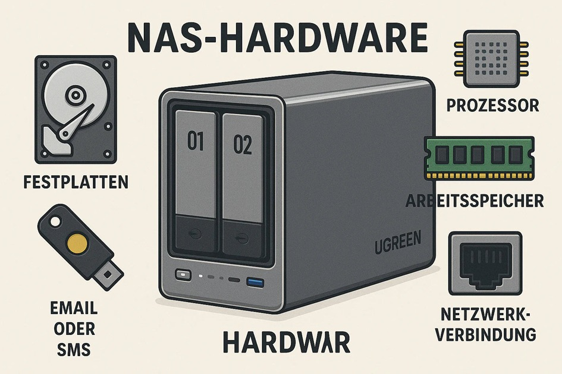
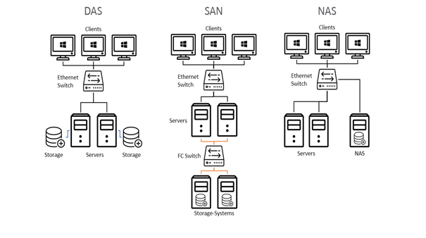

# **NAS - Network Attached Storage**

## **1. Einleitung**

Ein ***Network Attached Storage (NAS)*** ist ein netzgebundener Speicher, der Daten zentral speichert und über ein Netzwerk (z.b. *WLAN oder LAN*) verfügbar macht.  
Verschiedene Geräte sowie mehrere Benutzer können zeitgleich darauf zugreifen. Dadurch funktioniert es wie eine zentrale Datenablage, die sowohl im privaten Bereich sowie in Unternehmen genutzt werden kann.  
Ein NAS besteht in der Regel aus einem eigenen Gehäuse mit einer oder mehreren Festplatten und ist direkt mit dem Router verbunden.  
Häufig werden NAS-Systeme genutzt, um wichtige Dateien wie Fotos, Videos oder Dokumente zu sichern, Backups zu erstellen oder Medien auf andere Geräte zu streamen. 

 

## **2. Aufbau und Funktionsweise**

Ein NAS besteht aus folgenden Komponenten:

- **Gehäuse** mit Einschüben für Festplatten

- **Prozessor** & **RAM** zur Datenverarbeitung und Ausführung von
  Anwendungen

- **Festplatten** (HDD oder SSD, oft im RAID-Verbund)

- **Netzwerkanschluss** (LAN, teils auch 2,5GbE oder schneller)

- **NAS-Betriebssystem**, welches die Verwaltung übernimmt

 

  

***Abbildung 1:*** Aufbau eines NAS  

Das NAS wird über die Netzwerkschnittstelle in das lokale Netzwerk integriert und erhält eine eigene IP-Adresse. Der Zugriff auf die gespeicherten Daten erfolgt über standardisierte Netzwerkprotokolle.

 

**Ein NAS basiert auf dem Client-Server-Prinzip:**

- Das NAS (Server) stellt Speicherressourcen und Netzwerkdienste bereit.

- Clients (PC, Laptop, Smartphone, Smart-TV) greifen über das Netzwerk
  darauf zu.

- Die Kommunikation erfolgt über Netzwerkprotokolle wie SMB/CIFS, NFS,
  FTP oder WebDAV.  

 

**Ablauf eines Zugriffs:**

1.  **Verbindungsaufbau:** Der Client baut über das Netzwerk eine
    Verbindung auf, meist über TCP/IP

2.  **Authentifizierung und Autorisierung:** Das NAS überprüft die Identität des Nutzers (z. B. Benutzername/Passwort)   
    und kontrolliert die Zugriffsrechte auf Dateien und Verzeichnisse

3.  **Zugriff auf das Dateisystem:** Das NAS greift über sein internes Dateisystem auf die angeforderten Daten zu

4.  **Datenübertragung**

    1.  **Lesen:** Die Daten werden von den Festplatten in den
        Arbeitsspeicher geladen und anschließend über das Netzwerk an
        den Client übertragen.

    2.  **Schreiben:**  Die vom Client gesendeten Daten werden entgegengenommen, verarbeitet und auf den
        Festplatten gespeichert

5.  **Parallelverarbeitung:** Durch Multithreading und Netzwerkprotokolle kann das NAS mehrere Anfragen
    gleichzeitig bearbeiten

 

## **3. Nutzung und Einsatzbereiche**

Ein NAS wird hauptsächlich zur zentralen Speicherung und Verwaltung von Daten innerhalb eines Netzwerks eingesetzt. 
Ein wichtiger Einsatzbereich ist die Datensicherung. Viele NAS-Systeme bieten automatische Backup-Funktionen, mit denen Daten von Computern oder mobilen Geräten regelmäßig gesichert werden können. 

Im privaten Bereich wird ein NAS häufig als Medienserver genutzt. Inhalte wie Filme, Musik oder Fotos können im Netzwerk gespeichert und auf verschiedene Geräte wie Smartphones, Tablets oder Smart-TVs gestreamt werden.

In Unternehmen dient ein NAS vor allem als gemeinsamer Netzwerkspeicher, auf den mehrere Mitarbeiter gleichzeitig zugreifen können. Dadurch wird die Zusammenarbeit effizienter, da Dateien zentral gespeichert und gemeinsam bearbeitet werden können.

Zusätzlich ermöglichen viele NAS-Systeme den Fernzugriff über das Internet. Nutzer können somit auch außerhalb des lokalen Netzwerks sicher auf ihre Daten zugreifen, beispielsweise über eine Weboberfläche oder spezielle Apps.

 

## **4. Tools und Hersteller**

NAS-Systeme bringen zahlreiche integrierte Tools
und Funktionen mit, die über eine Weboberfläche gesteuert werden können. Dazu gehören unter anderem:

  - **Dateiverwaltung:**  Zugriff auf Dateien über den Browser oder Apps
  - **Backup-Tools:** Automatische Datensicherung von PCs oder Smartphones
  - **Benutzerverwaltung:** Verschiedene Nutzer mit eigenen Zugriffsrechten
  - **Cloud-Funktionen:** Synchronisation mit Diensten oder eigener Cloud-Zugriff
  - **Medienserver:** Streaming von Videos und Musik im Netzwerk

 

Zu den bekanntesten NAS-Hersteller zählen **Synology** und **QNAP**.
Beide Unternehmen bieten Lösungen für private Anwender sowie für
Unternehmen an. *Synology* ist insbesondere für seine
benutzerfreundliche Software bekannt, während *QNAP* häufig durch
leistungsstarke Hardware und erweiterte Funktionen wie Virtualisierung
überzeugt.

 

## **5. Vor und Nachteile**

 **Vorteile** | **Nachteile** |
|----------|-----------|
| Zentrale Datenspeicherung | Anschaffungskosten |
| Zugriff von mehreren Geräten | Einrichtung kann kompliziert sein |
| Datensicherheit durch RAID und Backups | Wartung erforderlich |
| Fernzugriff möglich | Sicherheitsrisiken bei falscher Konfiguration |
| Erweiterbarkeit des Speichers |

 

## **6. DAS vs. SAN vs NAS**  

### **Speicherarten:**

- **Dateispeicher (File Storage):**  
    Beim Dateispeicher werden Daten in einer bekannten Ordnerstruktur gespeichert - also in Dateien und Verzeichnissen. Jede Datei hat einen Namen und einen eindeutigen Speicherort (Pfad). Diese Art ist leicht verständlich und wird von Betriebssystemen direkt unterstützt. Ein typischer Vertreter von File Storage sind NAS-Systeme.

- **Blockspeicher (Block Storage):**  
    Beim Blockspeicher werden Daten in kleine Blöcke aufgeteilt und unabhängig voneinander gespeichert. Das System weiß dabei nicht, welche Art von Daten gespeichert wird. Dadurch ist Blockspeicher sehr schnell und flexibel. Typisch ist diese Speicherart für SAN und auch für DAS.

- **Objektspeicher (Object Storage):**  
    Beim Objektspeicher werden Daten als einzelne Objekte gespeichert. Jedes Objekt besteht aus den eigentlichen Daten, zusätzlichen Informationen (Metadaten) und einer eindeutigen ID. Es gibt keine klassische Ordnerstruktur wie beim Dateispeicher. Diese Art eignet sich besonders für große Datenmengen und wird häufig in Cloud-Diensten verwendet.

 

**DAS (Direct Attached Storage)** ist direkt mit einem einzelnen Computer oder Server verbunden Typische Beispiele sind externe Festplatten oder interne Laufwerke in einem PC. Der Zugriff ist nur von einem Gerät möglich und daher nicht für mehrere Nutzer gleichzeitig geeignet. DAS arbeitet meist mit **Blockspeicher**, da die Daten direkt auf Speicherblöcke geschrieben werden.

**NAS (Network Attached Storage)** ist über ein Netzwerk mit mehreren Geräten verbunden. Dadurch können mehrere Benutzer gleichzeitig auf die Daten zugreifen. Die Daten werden in Form von Dateien und Ordnern organisiert, weshalb NAS hauptsächlich **Dateispeicher (File Storage)** verwendet. Der Zugriff erfolgt über Netzwerkprotokolle wie SMB oder NFS.

**SAN (Storage Area Network)** ist ein leistungsstarkes Netzwerk, das vor allem in großen Unternehmen eingesetzt wird. Es verbindet mehrere Server mit zentralem Speicher und ermöglicht sehr schnellen Zugriff. SAN nutzt ebenfalls **Blockspeicher**. Die Einrichtung und Verwaltung ist deutlich komplexer und teurer als bei NAS oder DAS.

 

  

***Abbildung 2:*** DAS - NAS - SAN 
 
 

## **7. Literaturverzeichnis**

- **IBM:** <https://www.ibm.com/de-de/think/topics/network-attached-storage>

- **Netzwerk-Guides:** <https://netzwerk-guides.de/netzwerkspeicher-nas/>

- **Thomas Krenn:** <https://www.thomas-krenn.com/de/tkmag/expertentipps/storage-grundlagen-das-san-und-nas-im-ueberblick>

- **IONOS:** <https://www.ionos.at/digitalguide/server/knowhow/was-ist-ein-network-attached-storage-nas/?utm_source=chatgpt.com>

## **8. Abbildungsverzeichnis**

- **ChatGPT:** https://cdn.shopify.com/s/files/1/0711/5744/8935/files/ChatGPT_Image_2025_5_27_14_33_31.webp
  
- **Thomas Krenn:** https://www.thomas-krenn.com/de/tkmag/expertentipps/storage-grundlagen-das-san-und-nas-im-ueberblick/
