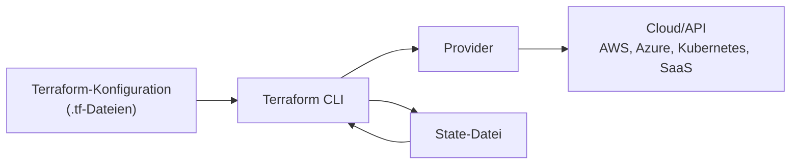

# Terraform – Ausarbeitung

## 1. Was ist Terraform?

Terraform ist ein Werkzeug für **Infrastructure as Code**, kurz **IaC**. Damit wird IT-Infrastruktur nicht mehr hauptsächlich manuell über GUI-oberflächen eingerichtet, sondern in Textdateien beschrieben. Diese Dateien können wie normaler Programmcode versioniert, geprüft, wiederverwendet und automatisiert ausgeführt werden. Terraform wird von HashiCorp entwickelt und dient dazu, Cloud-, On-Premise- und SaaS-Ressourcen sicher zu erstellen, verändern und verwalten. Dazu gehören zum Beispiel VMs, Netzwerke, Datenbanken, DNS-Einträge, Kubernetes-Cluster oder Benutzer- und Rollenstrukturen in Cloud-Plattformen.

Der wichtigste Gedanke dahinter lautet: **Die gewünschte Infrastruktur wird beschrieben, Terraform kümmert sich darum, diesen Zielzustand zu erreichen.** Man beschreibt also nicht jeden Klick, sondern den Zustand, der am Ende existieren soll. Beispiel: „Es soll ein Netzwerk, eine virtuelle Maschine und eine Datenbank geben.“ Terraform prüft dann, was bereits vorhanden ist und welche Änderungen notwendig sind, damit am Ende eben dieses Netzwerk, die VM und die Datenbank **genau so** vorhanden sind wie in der Terraform-Anleitung beschrieben.

## 2. Kontext und Einsatzgebiet

Terraform wird vor allem in den Bereichen **Cloud Computing**, **DevOps**, **Platform Engineering** und **Automatisierung von IT-Infrastruktur** eingesetzt. In modernen Unternehmen müssen Server, Netzwerke, Datenbanken und Sicherheitsregeln häufig schnell, wiederholbar und fehlerarm bereitgestellt werden. Manuelle Konfiguration ist dabei problematisch, weil sie schwer nachvollziehbar ist und leicht zu Abweichungen zwischen Test-, Staging- und Produktionsumgebungen führt, ganz zu schweigen von Human Error bei der Einrichtung mehrerer identer Systeme.

Terraform hilft dabei, Infrastruktur ähnlich wie Software zu behandeln. Die Konfigurationsdateien liegen meist in einem Git-Repository. Änderungen können dadurch über Pull Requests geprüft werden. Teams sehen genau, wer wann welche Infrastrukturänderung vorgeschlagen oder umgesetzt hat. Das verbessert Nachvollziehbarkeit, Zusammenarbeit und Sicherheit vor unauthorisierten Änderungen.

Typische Einsatzbereiche sind:

- Aufbau von Cloud-Infrastruktur bei AWS, Microsoft Azure oder Google Cloud
- Verwaltung von Kubernetes-Clustern
- Automatisierte Bereitstellung von Entwicklungs-, Test- und Produktionsumgebungen
- Standardisierung von Infrastruktur über wiederverwendbare Module
- Disaster Recovery, weil Infrastruktur aus Code neu aufgebaut werden kann
- Verwaltung von SaaS-Diensten, zum Beispiel Cloudflare oder GitHub

## 3. Grobe technische Funktionsweise

Terraform arbeitet deklarativ. Das bedeutet: Man beschreibt in Konfigurationsdateien, **was** existieren soll, nicht detailliert, **wie** jeder Schritt ausgeführt werden muss. Die Konfiguration wird in der Sprache **HCL** geschrieben, der HashiCorp Configuration Language.

Ein typischer Terraform-Ablauf besteht aus mehreren Schritten:

| Schritt | Bedeutung |
|---:|---|
| `terraform init` | Initialisiert das Projekt und lädt benötigte Provider und Module |
| `terraform plan` | Zeigt an, welche Änderungen Terraform durchführen würde |
| `terraform apply` | Führt die geplanten Änderungen aus |
| `terraform destroy` | Entfernt die verwaltete Infrastruktur wieder |

Eine zentrale Rolle spielt der **State**. Terraform speichert darin, welche realen Ressourcen zu welchen Ressourcen in der Konfiguration gehören. Der State dient vor allem dazu, Bindungen zwischen Objekten in einem Zielsystem und den in Terraform deklarierten Ressourcen zu speichern.

Vereinfacht funktioniert Terraform so:

Terraform liest die `.tf`-Dateien, lädt die passenden Provider, vergleicht die gewünschte Konfiguration mit dem aktuellen State und erstellt daraus einen Ausführungsplan. Danach spricht Terraform über Provider mit den jeweiligen APIs der Zielsysteme.

## 4. Provider, Module und Backends

### Provider

Provider sind Plugins, mit denen Terraform mit externen Plattformen kommuniziert. Ein Provider übersetzt Terraform-Ressourcen in API-Aufrufe des jeweiligen Dienstes. Der AWS-Provider kann zum Beispiel EC2-Instanzen, VPCs oder S3-Buckets verwalten. Der Kubernetes-Provider kann Kubernetes-Ressourcen erstellen.

Beispiele für bekannte Provider:

| Provider | Typische Verwendung |
|---:|---|
| AWS | EC2, S3, VPC, IAM, RDS |
| AzureRM | Azure Virtual Machines, Resource Groups, VNets |
| Google Cloud | Compute Engine, Cloud SQL, IAM |
| Kubernetes | Deployments, Services, Namespaces |
| Cloudflare | DNS, Firewall-Regeln, Zero Trust |
| GitHub | Repositories, Teams, Rechte |

### Module

Module sind wiederverwendbare Bausteine. Ein Modul ist eine Sammlung von Ressourcen, die gemeinsam verwaltet werden. Ein Modul könnte zum Beispiel eine komplette VPC mit Subnets, Routing-Tabellen und Sicherheitsregeln erzeugen. Dadurch müssen Teams nicht jedes Mal denselben Code neu schreiben, sondern können ganz einfach ein geprüftes Modul wiederverwenden.

### Backends und Remote State

Das Backend legt fest, wo Terraform seinen State speichert. Standardmäßig kann der State lokal als Datei liegen. In Teams ist das aber riskant, weil mehrere Personen gleichzeitig Änderungen ausführen könnten oder der State verloren gehen könnte. Deshalb wird häufig ein Remote Backend verwendet, zum Beispiel HCP Terraform, Amazon S3 mit DynamoDB-Locking, Azure Storage oder Google Cloud Storage.

## 5. Gängige Produkte, Tools und Projekte

Terraform ist Teil eines größeren Ökosystems. Wichtige Produkte und verwandte Tools sind:

| Produkt/Tool | Beschreibung |
|---:|---|
| Terraform CLI | Kommandozeilenwerkzeug zum Initialisieren, Planen und Anwenden |
| HCP Terraform / Terraform Cloud | Plattform von HashiCorp für Remote State, Workspaces, Policy Checks und Teamarbeit |
| Terraform Enterprise | Selbst gehostete Enterprise-Variante für große Organisationen |
| Terraform Registry | Öffentliche Sammlung von Providern, Modulen und Policies |
| OpenTofu | Community-Fork von Terraform |
| Terragrunt | Wrapper-Tool zur Vereinfachung komplexer Terraform-Projekte |
| Atlantis | Tool für Terraform-Workflows über Pull Requests |
| Spacelift / env0 / Scalr | Plattformen für IaC-Automatisierung und Terraform-Workflows |

Die Terraform Registry ist direkt in Terraform integriert und erlaubt das Verwenden veröffentlichter Provider und Module.

## 6. Terraform und OpenTofu

Ein wichtiger Punkt ist die Lizenzsituation. HashiCorp hat die Lizenz neuer Terraform-Versionen ab Terraform 1.6 von der Mozilla Public License zu einer Business Source License geändert. Daraufhin ist OpenTofu als Fork aus der Terraform-Community entstanden. OpenTofu hat das Ziel, eine vollständig Open-Source-kompatible Alternative zu Terraform bereitzustellen.

Für viele Lern- und Praxiszwecke sind Terraform und OpenTofu ähnlich, weil OpenTofu ursprünglich aus Terraform hervorgegangen ist. In Unternehmen kann die Wahl zwischen beiden Werkzeugen aber von Lizenzfragen, Support, Governance und vorhandener Tool-Landschaft abhängen.

## 7. Beispielhafte reale Anwendung

Ein Unternehmen möchte eine Webanwendung in AWS betreiben. Dafür werden benötigt:

- ein Netzwerk mit öffentlichen und privaten Subnetzen
- Load Balancer
- virtuelle Maschinen oder Container
- Datenbank
- DNS-Eintrag
- Sicherheitsgruppen und IAM-Rollen

Ohne Terraform müssten Administratoren viele Einstellungen manuell in der AWS-Konsole durchführen. Mit Terraform wird diese Infrastruktur in Dateien beschrieben. Danach kann sie automatisch erstellt, geändert und bei Bedarf in einer zweiten Region erneut aufgebaut werden. Besonders nützlich ist, dass Terraform vor der Ausführung mit `terraform plan` zeigt, was passieren wird. Dadurch können gefährliche Änderungen vorab erkannt werden.

## 8. Vorteile und Grenzen

| Vorteil | Erklärung |
|---:|---|
| Wiederholbarkeit | Infrastruktur kann mehrfach gleich aufgebaut werden |
| Nachvollziehbarkeit | Änderungen sind in Git sichtbar |
| Automatisierung | Weniger manuelle Klickarbeit |
| Multi-Cloud-Fähigkeit | Ein Werkzeug kann viele Plattformen verwalten |
| Planbarkeit | `terraform plan` zeigt Änderungen vor der Ausführung |

Terraform hat aber auch Grenzen. Der State muss sorgfältig geschützt werden, weil er sensible Informationen enthalten kann. Außerdem ersetzt Terraform kein vollständiges Konfigurationsmanagement innerhalb von Servern. Für Aufgaben wie Softwareinstallation auf Servern werden oft zusätzliche Tools wie Ansible, cloud-init oder Kubernetes genutzt. Auch Teamarbeit muss sauber organisiert werden, damit nicht mehrere Personen gleichzeitig widersprüchliche Änderungen ausführen.

## 9. Zusammenfassung

Terraform ist ein zentrales Werkzeug im Bereich Infrastructure as Code. Es ermöglicht, Infrastruktur in lesbaren Konfigurationsdateien zu beschreiben und automatisiert auf verschiedenen Plattformen bereitzustellen. Die technische Grundlage bilden Terraform-Konfigurationen, Provider, State-Dateien, Backends und Module. Besonders wichtig ist der deklarative Ansatz: Nicht der genaue Ablauf wird beschrieben, sondern der gewünschte Zielzustand.

In der Praxis wird Terraform vor allem in Cloud- und DevOps-Umgebungen verwendet, um Infrastruktur reproduzierbar, versionierbar und kontrollierbar zu machen. Durch Provider kann Terraform mit vielen Diensten wie AWS, Azure, Google Cloud, Kubernetes, Cloudflare oder GitHub arbeiten. Ergänzende Plattformen wie HCP Terraform, Atlantis, Spacelift oder OpenTofu erweitern das Ökosystem.

Kurz gesagt: **Terraform ist wie ein Bauplan und ein automatisierter Bauleiter für IT-Infrastruktur.** Der Bauplan steht im Code, Terraform vergleicht ihn mit der Realität und setzt die notwendigen Änderungen um.

## 10. Quellen

- HashiCorp Developer: Terraform Documentation, https://developer.hashicorp.com/terraform/docs
- HashiCorp Developer: Terraform Language – State, https://developer.hashicorp.com/terraform/language/state
- HashiCorp Developer: Terraform Language – Providers, https://developer.hashicorp.com/terraform/language/providers
- HashiCorp Developer: Terraform Language – Modules, https://developer.hashicorp.com/terraform/language/modules
- HashiCorp Developer: Terraform Language – Backends, https://developer.hashicorp.com/terraform/language/backend
- HashiCorp Developer: Terraform Registry, https://developer.hashicorp.com/terraform/registry
- OpenTofu: Manifesto, https://opentofu.org/manifesto/